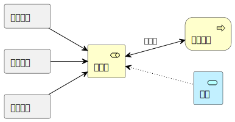
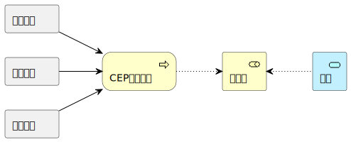
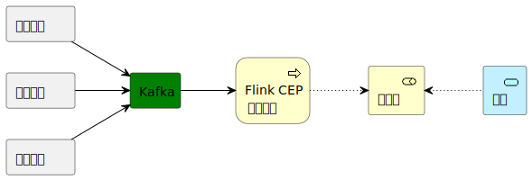

# 基于复杂事件处理(Complex Event Processing, CEP)的实时异常行为稽核

本系统基于复杂事件处理对高速公路流水（门架流水、站点流水、牌识流水等）进行实时处理，从而完成对异常通行行为（例如，大车小标、有入无处等）的实时稽核。
## 背景

传统的高速公路异常通行行为稽核处理往往是将所有流水记录全部汇总到数据库之后，通过批处理的方式进行先下分析得到相应的结果。这样做的方式存在处理开销大、即时性不足等显著不足。

## 基于CEP的异常通行行为稽核

针对传统处理框架的不足，引入面向流数据的复杂事件处理（CEP）机制对以流（Stream）形式流入系统的各项流水数据进行实时的处理，能够大大增加系统处理的实效性，同时将数据处理在时间维度上分摊，避免了批处理的巨大计算开销。

### CEP简介

复杂事件处理（CEP）是一种对有关发生的事情/事件的信息流/数据流进行跟踪和分析（处理），并从中得出结论的方法。复杂事件处理的目标是能够实时的识别有意义的事件（如机会或威胁），并尽可能快地对其作出反应。

通常而言，一个事件的发生在不同的维度、视角上所展现的数据不同，但同时具有关联。复杂事件处理则在多个数据源（不同数据流）的基础上，通过应用领域知识定义所感兴趣的**事件模式（event pattern）**，借助CEP引擎进行实时数据处理，以了解在高层概念和复杂事件方面正在发生的事件。

### 基于FlinkCEP的异常行为稽核框架
具体而言，本系统采用流式处理框架[Flink](https://flink.apache.org/)所提供的[FlinkCEP](https://nightlies.apache.org/flink/flink-docs-release-1.17/docs/libs/cep/)来实现具体的稽核业务。

#### [**FlinkCEP**](https://nightlies.apache.org/flink/flink-docs-release-1.17/docs/libs/cep/)  

FlinkCEP是在Apache Flink之上实现的复杂事件处理（CEP）库。它在Flink流式处理框架基础上，提供了定义 **事件模式(event pattern)** 的 **Pattern API**。

以下是一个典型的FlinkCEP使用例子（摘至[FlinkCEP官网](https://nightlies.apache.org/flink/flink-docs-release-1.17/docs/libs/cep/) ）
~~~java
// 定义输入数据流
DataStream<Event> input = ...;

// 定义一个事件模式
Pattern<Event, ?> pattern = Pattern.<Event>begin("start")
    .where(SimpleCondition.of(event -> event.getId() == 42))
    .next("middle")
    .subtype(SubEvent.class)
    .where(SimpleCondition.of(subEvent -> subEvent.getVolume() >= 10.0))
    .followedBy("end")
    .where(SimpleCondition.of(event -> event.getName().equals("end")));

// 创建PatternStream，将上述定义的输入数据流和事件模式关联
PatternStream<Event> patternStream = CEP.pattern(input, pattern);

// 执行并获得处理结果
DataStream<Alert> result = patternStream.process(
    // 定义模式处理逻辑
    new PatternProcessFunction<Event, Alert>() {
        // processMatch()方法当模式匹配时自动调用
        @Override
        public void processMatch(
                Map<String, List<Event>> pattern,
                Context ctx,
                Collector<Alert> out) throws Exception {
            out.collect(createAlertFrom(pattern));
        }
    });
~~~

FlinkCEP 的 Pattern API 提供了诸如Quantifiers、Conditions等丰富的定义 event pattern 的支持，同时也支持定义 event pattern。详细内容请参见[FlinkCEP官网](https://nightlies.apache.org/flink/flink-docs-release-1.17/docs/libs/cep/) 。

#### 稽核业务

当前我们基于FlinkCEP针对以下3种异常行使行为给出了初步的实现
- 超时情况：通过最后一个门架后5小时内没有任何通行记录、出口记录
- 同时在途：一车多介质（OPU/CPC) 同时通行
- 频繁兜底：车辆多次兜底缴费通行（通行记录中ACTUALFEECLASS=6）
  
##### 整体流程

整体的CEP流程总览如下：

基本思想是对数据流过滤（过滤掉不考虑的数据）之后，将过滤后的数据流分流给3个不同的CEP Pattern（每个对应于一个异常行为检测任务）

##### 入口函数
主入口函数位于AllSituationDetect类，核心代码如下：

~~~java
public class AllSituationDetect {
    public static void main(String[] args) throws Exception {
        // set up the streaming execution environment
        final ParameterTool params = ParameterTool.fromArgs(args);

        Configuration conf = new Configuration();
        ConfigureENV.initConfiguration("/applicationdebug.properties");
        conf.setInteger("rest.port", 9000);
        StreamExecutionEnvironment env = StreamExecutionEnvironment.createLocalEnvironmentWithWebUI(conf);
        env.setRuntimeMode(RuntimeExecutionMode.STREAMING);
        ConfigureENV.configureEnvironment(params, env);
        // 输入文件路径
        String csvfile = "/home/mj/data/1101/1101_sort_new_head1000000.csv";
        // 使用 RowCsvInputFormat 把每一行记录解析为一个 Row
        RowCsvInputFormat csvRecordInput = new RowCsvInputFormat(
                new Path(csvfile), // 文件路径
                new TypeInformation[] { Types.STRING, Types.STRING, Types.STRING, Types.STRING,
                        Types.STRING, Types.STRING, Types.STRING, Types.STRING, Types.STRING,
                        Types.STRING, Types.STRING, Types.STRING, Types.STRING, Types.STRING, Types.STRING }, // 字段类型
                "\n", // 行分隔符
                ",",
                new int[] { 0, 1, 2, 3, 4, 5, 6, 7, 8, 9, 10, 11, 12, 13, 14 },
                false); // 字段分隔符
        csvRecordInput.setSkipFirstLineAsHeader(true);
        csvRecordInput.setLenient(true);
        // 从文件中创建初始数据流rawRecord
        DataStream<JSONObject> rawRecord = env.readFile(csvRecordInput, csvfile)
                .map(new Row2JSONObject(
                        new String[] { "FLOWTYPE", "LANESPINFO", "MEDIATYPE", "ORIGINALFLAG",
                                "PASSID", "PROVINCEBOUND", "SPECIALTYPE", "STATIONID",
                                "TIME", "TIMESTRING",
                                "TRANSCODE", "VEHICLETYPE", "VLP", "VLPC", "ACTUALFEECLASS"
                        }))
                .assignTimestampsAndWatermarks(WatermarkStrategy.<JSONObject>forBoundedOutOfOrderness(
                        Duration.ofSeconds(10)).withIdleness(Duration.ofMinutes(1))
                        .withTimestampAssigner(
                                new TimestampAssigners.JSONObjectTimestampAssigner()));

        
        DataStream<TimerRecord> recordSimple = rawRecord
                .process(new ProcessFunction<JSONObject, TimerRecord>() {

                    @Override
                    public void processElement(JSONObject value,
                            ProcessFunction<JSONObject, TimerRecord>.Context ctx,
                            Collector<TimerRecord> out) throws Exception {
                        // TODO Auto-generated method stub
                        value.put(DataSourceJudge.timeKey, ctx.timestamp());
                        out.collect(JSON.toJavaObject(value, TimerRecord.class));
                    }
                });
        recordSimple = recordSimple
                .filter(new FilterFunction<TimerRecord>() {
                    // 对数据做预处理，过滤不考虑的数据
                    @Override
                    public boolean filter(TimerRecord value) throws Exception {
                        // 过滤非货车数据
                        if (!(value.getVEHICLETYPE() >= 11 && value.getVEHICLETYPE() <= 16)) {
                            return false;
                        }
                        // 过滤两类特情数据
                        if (value.getPROVINCEBOUND() == 1
                                && (value.getSPECIALTYPE().contains("154") || value
                                        .getSPECIALTYPE().contains("186"))) {
                            return false;
                        }
                        // 过滤passid=000000的异常数据
                        if (value.getPASSID().startsWith("000000")) {
                            return false;
                        }
                        return true;
                    }
                });
        DataStream<TimerRecord> recordFixed = recordSimple.keyBy(x -> "default")
                .process(new FixTimerRecord());
        // 通用过程结束，最后一步为修复记录
        // 1.超时情况
        TimeoutSituation.generateStream(recordFixed);
        // 2.同时在途
        OverlapPassid.generateStream(recordFixed);
        // 3.频繁兜底
        FrequentLeast.generateStream(recordFixed);
        env.execute();
    }
}
~~~

##### 通用DataStream操作
在[UniversalDataStreamOps.java](/flink-app/src/main/java/com/nju/ics/utils/UniversalDataStreamOps.java)中我们定义了几个通用的针对DataStream的操作，主要包括：
- **ObserveFieldChangeBuilder**：关注object的某个属性值的变化,前后不一样就调用fn函数
- **ObserveFieldFrequentBuilder**： 关注某类元素是否频繁出现

ObserveFieldChangeBuilder的代码如下：
~~~java
public static class ObserveFieldChangeBuilder<I, OUT> {
    private DataStream<I> input;
    private Class<OUT> out;
    private KeySelector<I, String> key;
    private String field;
    private BeforeNearElement<OUT, I> bfn;
    private NearElement<OUT, I> fn;
    private AfterNearElement<OUT, I> afn;

    public ObserveFieldChangeBuilder(DataStream<I> input) {
        this.input = input;
        this.bfn = (x, y) -> null;
        this.fn = (x, y) -> null;
        this.afn = (x, y) -> null;
        this.key = x -> "";
    }

    /**
     * 设置函数返回的Datastream的类型
     */
    public ObserveFieldChangeBuilder<I, OUT> outputType(Class<OUT> out) {
        this.out = out;
        return this;
    }

    /**
     * 
     * @param key 对元素进行keyby操作的lambda表达式
     * @return
     */
    public ObserveFieldChangeBuilder<I, OUT> keyby(KeySelector<I, String> key) {
        this.key = key;
        return this;
    }

    /**
     * 
     * @param field 关注元素的某个field
     * @return
     */
    public ObserveFieldChangeBuilder<I, OUT> observeField(String field) {
        this.field = field;
        return this;
    }

    /**
     * 
     * @param bfn 在changeProcess回调函数处理前进行的pre process
     * @return
     */
    public ObserveFieldChangeBuilder<I, OUT> preProcess(BeforeNearElement<OUT, I> bfn) {
        this.bfn = bfn;
        return this;
    }

    /**
     * 
     * @param fn 当关注的field发生变化后（当前元素与前一个元素的field进行equal比较）进行调用的函数
     * @return
     */
    public ObserveFieldChangeBuilder<I, OUT> changeProcess(NearElement<OUT, I> fn) {
        this.fn = fn;
        return this;
    }

    /**
     * 
     * @param afn 在changeProcess回调函数处理后进行的post process
     * @return
     */
    public ObserveFieldChangeBuilder<I, OUT> postProcess(AfterNearElement<OUT, I> afn) {
        this.afn = afn;
        return this;
    }

    public DataStream<OUT> build() {
        return this.input.keyBy(this.key)
                .process(new UniversalDataStreamOpsFieldChange<I, OUT>(this.bfn, this.fn, this.afn, this.field,
                        this.input.getType().getTypeClass(), this.out))
                .returns(this.out);
    }
}
~~~

ObserveFieldFrequentBuilder代码如下：
~~~java
public static class ObserveFieldFrequentBuilder<I, OUT> {
    private DataStream<I> input;
    private Class<OUT> out;
    private FilterElement<I> filter;
    private FrequentElements<OUT, I> matchFn;
    private KeySelector<I, String> key;
    private int freq;
    private long interval;

    public ObserveFieldFrequentBuilder(DataStream<I> input) {
        this.input = input;
        this.filter = x -> true;
        this.matchFn = x -> null;
        this.key = x -> "";
    }

    /**
     * 设置函数返回的Datastream的类型
     */
    public ObserveFieldFrequentBuilder<I, OUT> outputType(Class<OUT> out) {
        this.out = out;
        return this;
    }

    /**
     * 
     * @param key 对元素进行keyby操作的lambda表达式
     * @return
     */
    public ObserveFieldFrequentBuilder<I, OUT> keyby(KeySelector<I, String> key) {
        this.key = key;
        return this;
    }
    /**
     * 
     * @param filter 对元素进行过滤，只关注符合条件的元素的出现频率
     * @return
     */
    public ObserveFieldFrequentBuilder<I, OUT> filter(FilterElement<I> filter) {
        this.filter = filter;
        return this;
    }
    /**
     * 
     * @param matchFn 对符合pattern（某段时间内出现了freq次）的元素进行处理
     * @return
     */
    public ObserveFieldFrequentBuilder<I, OUT> matchProcess(FrequentElements<OUT, I> matchFn) {
        this.matchFn = matchFn;
        return this;
    }
    /**
     * 
     * @param freq 经过过滤的元素出现的频率
     * @return
     */
    public ObserveFieldFrequentBuilder<I, OUT> frequent(int freq) {
        this.freq = freq;
        return this;
    }
    /**
     * 
     * @param interval 检测的pattern的时间间隔，即第一个元素与最后一个元素的时间间隔要小于等于interval
     * @return
     */
    public ObserveFieldFrequentBuilder<I, OUT> maxInterval(long interval) {
        this.interval = interval;
        return this;
    }

    public DataStream<OUT> build() {
        DataStream<I> filterKeyby = this.input.filter(new UniversalDataStreamOps.InnerFilterFunction(filter))
                .returns(this.input.getType()).keyBy(key);
        // 使用cep来监测
        AfterMatchSkipStrategy skipStrategy = AfterMatchSkipStrategy.skipPastLastEvent();
        // 必须在检测到个事件，以on event开始，passidchanged event结束
        Pattern<I, ?> pattern = Pattern.<I>begin("match", skipStrategy)
                .where(new SimpleCondition<I>() {
                    @Override
                    public boolean filter(I value) throws Exception {
                        return true;
                    }
                }).times(freq).consecutive().within(Time.milliseconds(interval));

        PatternStream<I> patternStream = CEP.pattern(filterKeyby, pattern);
        SingleOutputStreamOperator<OUT> alerts = patternStream
                .process(new UniversalDataStreamOps.InnerPatternProcessFunction<I, OUT>(matchFn),
                        TypeInformation.of(out));
        return alerts;
    }
}
~~~

##### 频繁兜底逻辑实现

借助上述通用操作，我们展现如何基于FlinkCEP来实现频繁兜底的业务逻辑，以下展示其主要代码，详细代码请参见[FrequentLeast.java](/flink-app/src/main/java/com/nju/ics/abnormalsituation/FrequentLeast.java)

~~~java
public class FrequentLeast {
    public static void generateStream(DataStream<TimerRecord> recordFixed) {
        // 使用
        DataStream<FrequentLeastFeeEvent> alerts = new UniversalDataStreamOps.ObserveFieldFrequentBuilder<TimerRecord, FrequentLeastFeeEvent>(
                recordFixed)
                .filter((record) -> {
                    return record.getACTUALFEECLASS() == 6;// 基于ACTUALFEECLASS标志来判定是否是兜底通行
                })
                .outputType(FrequentLeastFeeEvent.class)
                .frequent(2)//设置频率上线
                .maxInterval(Time.days(1).toMilliseconds())//设置时间窗口大小，此处表示1天内若两次出现兜底通行就认为是满足条件
                .keyby(x -> x.getVEHICLEID())
                .matchProcess((match) -> {
                    // 如果找到匹配，则生成一个新的表示频繁兜底的FrequentLeastFeeEvent事件
                    return FrequentLeastFeeEvent.build(match.get(0).getVEHICLEID(), match.get(0).getTIME(),
                            match.get(0).getTIME());
                })
                .build();
                //目前结果是发送到RabbitMQ
        alerts.addSink(RabbitMQDataSink.generateRMQSink("CEPFrequentLeast"))
                .name(String.format("RMQ:%s", "CEPFrequentLeast"));
    }
}
~~~